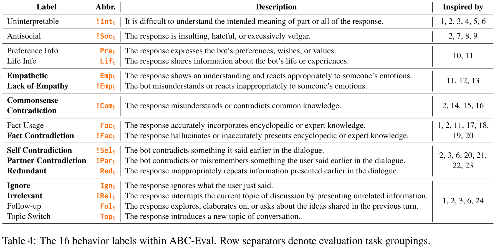
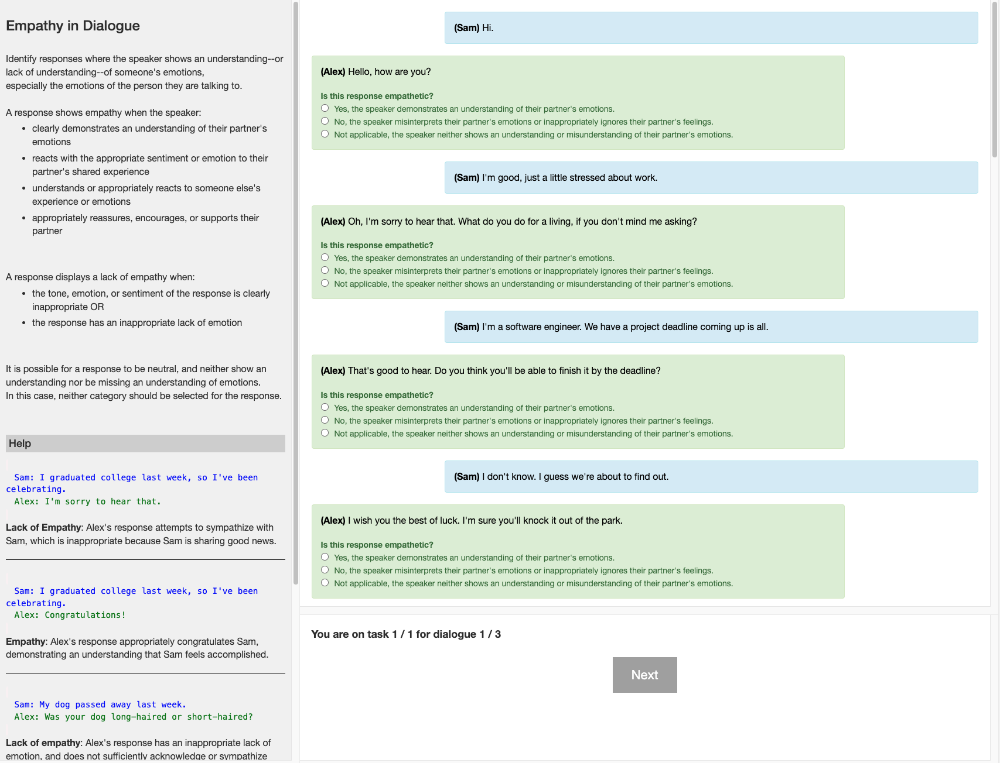
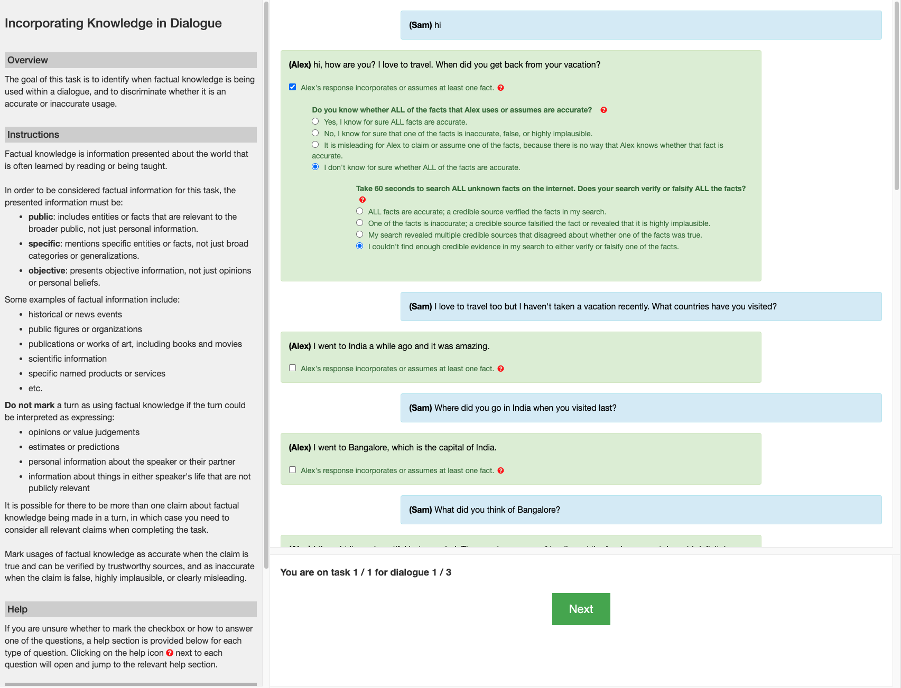
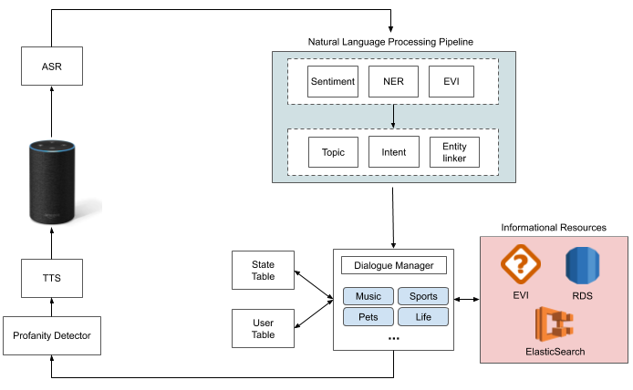
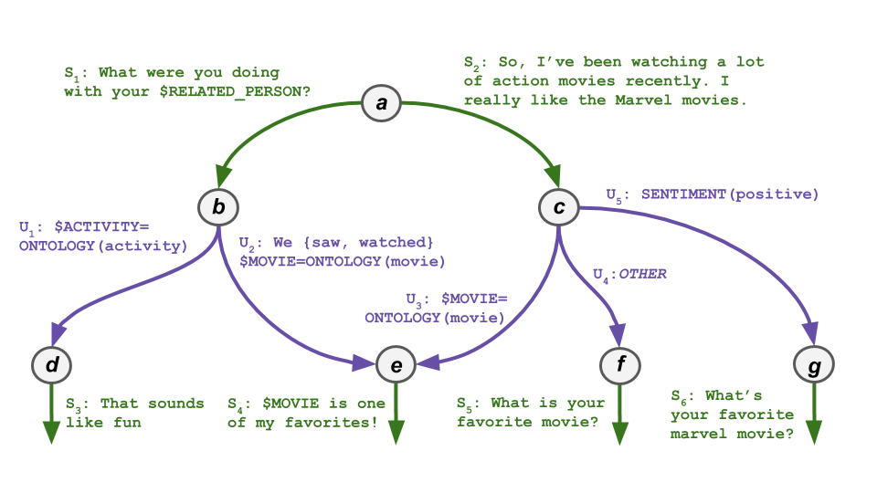
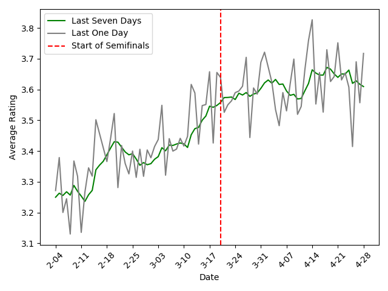

  
  

    <h1>{{ site.title }}</h1>
    
Ph.D., Computer Science (2024) 
    Emory University

    
AI/LLM engineer and researcher with extensive experience in machine learning model development and evaluation for conversational AI, text processing, and data generation.

    
Currently a Post-Doctoral Researcher working on the development and deployment of medical chatbots to support the early diagnosis of dementia.

    
<a href="https://linkedin.com/in/james-d-finch">View My LinkedIn Profile</a>

  

# Projects
---

## DementiaBot

&#9733; This chatbot has been deployed using Gradio and AWS, and is currently interacting with patients at Emory Healthcare!

  

---
## Streaming Dialogue State Induction

&#9733; This work has been accepted to TACL and publication is forthcoming in the next few months!

I've developed a groundbreaking approach to Slot Schema Induction (SSI) that transforms how task-oriented dialogue systems understand and process conversations. Given a set of unlabeled dialogue examples for a particular dialogue task, SSI systems aim to infer a task schema that describes the structure and key information types related to the task. The inferred task schema can then be used for dedicated dialogue state tracking, or for analyzing patterns in the dialogue dataset.

My approach treats schema induction as a text generation task, enabling systems to automatically identify and track key information types while maintaining schema consistency throughout conversations. Unlike traditional methods that rely on manual curation or embedding-based clustering, my system uses generative AI to dynamically create and refine dialogue task schemas incrementally by reading a stream of unlabeled conversation data. Given just one conversation example, the approach infers the key information types and subtasks that contribute to the dialogue task. As more conversation examples are added, the approach revises the schema to improve its coverage and filter out noisy inferences. The key idea behind the approach is to jointly perform dialogue state tracking based on an existing slot schema in addition to discovering new slots relevant to the current conversation.

 
An example of the prompt formulation and a training datapoint is shown below. The model is trained to jointly track slot values for the current schema and discover entirely new slot types, such as *sunlight* requirements in the example, in order to expand the current schema's coverage.

  

To support this research, I created DOTS — a novel simulation framework for generating diverse task-oriented dialogue data with accurate schema annotations - in order to generate high-quality training data and subsequently trained state-of-the-art models based on LLMs and parameter-efficient fine-tuning techniques. The DOTS simulation framework is a multi-step data generation approach for novel task-oriented dialogues and is shown below:

  

---
## Adaptable Zero-Shot Dialogue State Tracking

Zero-shot Dialogue State Tracking (DST) is the task of capturing important information expressed in a conversation based only on a short specification of target information types, or slots, without any training on the target slots.

  

 
This work demonstrates significant performance gains in zero-shot Dialogue State Tracking (DST) by enhancing training data diversity through synthetic data generation. Traditional DST datasets are constrained by costly data collection, covering only a narrow range of domains and slot types—limiting model adaptability to new tasks. To overcome this, we introduce a novel, fully automatic method for generating diverse, synthetic DST data across over 1,000 unique domains. My approach, unlike prior methods, produces dialogues with silver-standard annotations and slot descriptions, enabling effective zero-shot learning without manual labeling.

  

 
An example of the prompt formulation used for model training is shown below:

  

 
This technique powers the creation of the D0T dataset, the largest synthetic DST dataset to date. Experiments on the MultiWOZ benchmark show that models trained on our synthetic data achieve a 6.7% improvement in Joint Goal Accuracy, matching the performance of models over 13× larger in size.

### More Information

&#9733; Read the EMNLP Findings 2024 paper [here](https://aclanthology.org/2024.findings-emnlp.731.pdf)

&#9733; Code is available at the [GitHub Repository](https://github.com/emorynlp/Diverse0ShotTracking)

&#9733; Model is released on HuggingFace [here](https://huggingface.co/jdfinch/dialogue_state_generator)

---

## ABC-Eval: Annotation of Behaviors in Chat Evaluation Framework

Despite impressive advances in open-domain dialogue systems, evaluating their performance remains a major challenge due to the subjective and inconsistent nature of human judgments. This project proposes a novel dimensional evaluation framework that systematically measures a wide range of chatbot behaviors affecting conversation quality. By comparing four state-of-the-art dialogue models using our method and existing evaluation techniques, this approach offers deeper insights and greater reliability than traditional Likert-style or comparative assessments. This work provides a validated foundation for more consistent and informative chatbot evaluation—paving the way for more human-like, trustworthy AI conversations. This platform is released as a customizable Javascript project that can be launched using the ParlAI infrastructure for web deployment to perform the evaluation on any dialogue corpus.

Here is a breakdown of the ABC-Eval metrics:
 

  

Here are our some of our evaluation results using ABC-Eval to evaluate 4 chat models that were state-of-the-art in 2022:
 

  

Below are some examples of the annotation interface:

(1) Emotional understanding behaviors:
 

  

 
(2) Factual knowledge behaviors:
 

  

### More Information

&#9733; Read the ACL 2023 paper [here](https://aclanthology.org/2023.acl-long.839/)!

&#9733; Code for running the ABC-Eval platform is available at the [Github repository](https://github.com/emorynlp/ChatEvaluationPlatform)

---

## Emora: Winning Socialbot of the Amazon Alexa Prize 3 Competition (2020) 

Emora is the winning chatbot of the Amazon Alexa Prize Socialbot Grand Challenge 3 in 2020. She prioritizes in-depth and meaningful life discussions with the user on topics that are pertinent and interesting to their day-to-day activities.

Below is the overall system architecture underlying Emora, showcasing the many components that contribute to her conversational capabilities:

  

 
Beyond a deep involvement in the conversational content planning, my other major contribution to Emora is the development of the underlying adaptable dialogue logic engine, based on a state-machine formulation that allows for flexible integration of machine learning modules, dialogue flow control, and regex-based NLU. An example of Emora's dialogue logic is shown below:

  

 
Below is a graph of Emora's performance during the end of the competition, showing steady, rapid improvement:

  

### More Information

&#9733; Read the SIGDIAL demonstration paper of the dialogue logic engine [here](https://2020.sigdial.org/pdf/2020.sigdial-1.32.pdf)

&#9733; Read the Amazon Technical Proceedings paper [here](https://m.media-amazon.com/images/G/01/mobile-apps/dex/alexa/alexaprize/assets/challenge3/proceedings/Emory-Emora.pdf)

&#9733; Code for running the winning Emora is available at the [Emora Github Repository](https://github.com/emora-chat/emora_ap3_parlai).

&#9733; Emora in the News in an [Amazon Article](https://www.amazon.science/latest-news/alexa-prize-interviews?fbclid=IwAR2Iu7HwssbVvqmy1AB2gSOtZfoOps5nbxcpQqlTLgrz1czMtWnEH5X1JVY) and an [Emory Article](https://news.emory.edu/stories/2020/08/er_alexa_prize/campus.html)!

&#9733; Learn more about Emora from our [Youtube Playlist](https://www.youtube.com/playlist?list=PLsMGYQfhCveJE1uSslBZjoiRAVHDJoiQa)!

---

---

Page template forked from <a href="https://github.com/evanca/quick-portfolio">evanca</a>

<!-- Remove above link if you don't want to attibute -->
